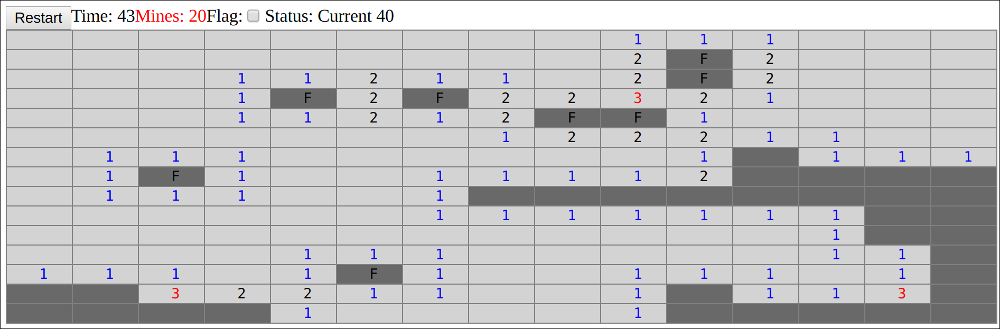

This is a mine sweeper in Haskell Reflex

## JSaddle work (fast iterations)

```shell
nix-shell -A shells.ghc8_2_1

cabal new-repl
>>> go
```

- Open your browser to "http://localhost:3003"

## Android application

```shell
nix-build -A android.frontend
```

You will get your APK inside `result`.

## Screenshot



## TODO

- Count the number of remaining mines
- Runtime change of the game geometry (size / nb mines)
- Nicer display on failure
- Nice icons
- Nice CSS
- Cascade opening with animation
