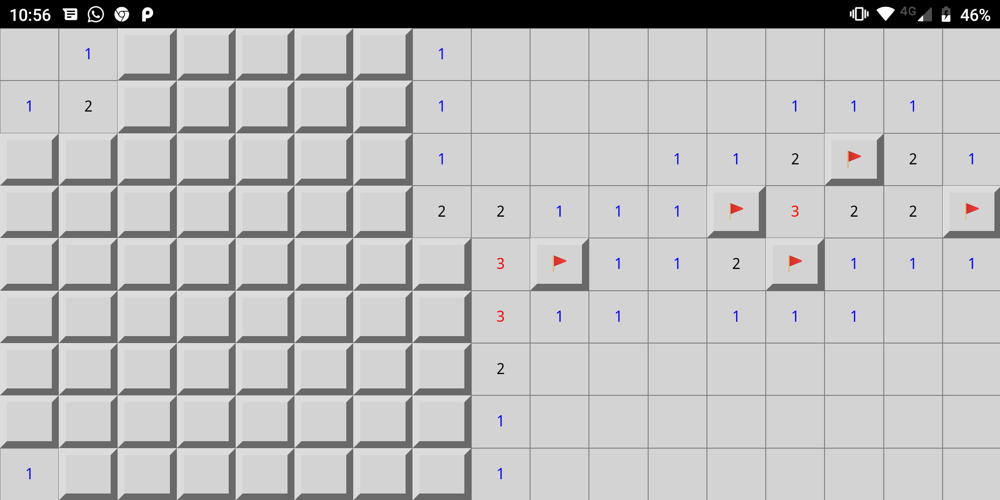
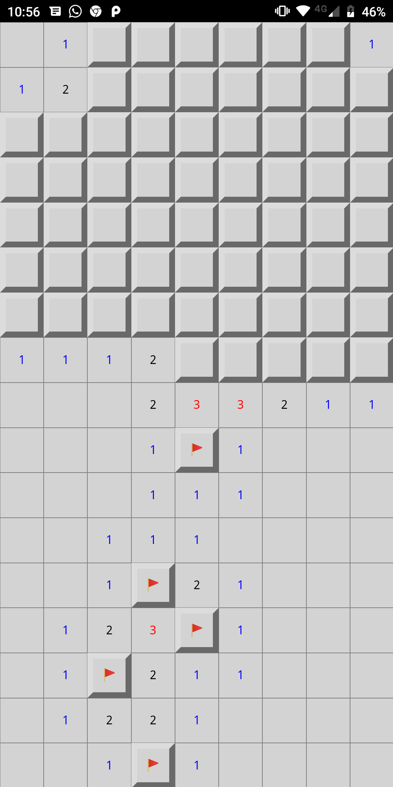

This is a mine sweeper in Haskell Reflex.

The grid is of fixed size and the UI aims at beeing minimalist. No
mine count, no timer, just the grid. Simple click set a flag, double
click reveals a case.

## Screenshot





## Hacking

### JSaddle work (fast iterations)

```shell
nix-shell

cabal new-repl
>>> go
```

- Open your browser to http://localhost:3003

### Android application

```shell
nix-build -A android.MineSweeper
```

You will get your APK inside `result`. You may need to uninstall it first using `adb uninstall org.guibou.MineSweeper`.
